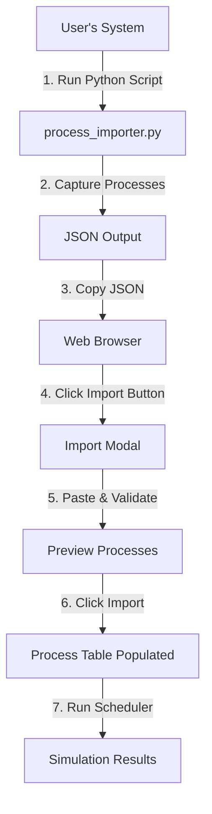

# Feature 9: System Process Import - Implementation Summary

## 🎯 Overview

Feature 9 enables users to import **real system processes** from their computer into the CPU Scheduler Simulator, bridging the gap between theoretical scheduling and real-world workloads.

## 📦 Components

### 1. Python Helper Script (`utils/process_importer.py`)
- **Lines of Code**: ~260 lines
- **Dependencies**: `psutil` (cross-platform process library)
- **Functionality**:
  - Captures running system processes
  - Maps process attributes to scheduler parameters
  - Supports JSON, CSV, and paste formats
  - Filtering by process name
  - Limit number of processes captured

### 2. Frontend Import UI (`scheduler-main.js`)
- **Lines Added**: ~220 lines
- **Key Functions**:
  - `openSystemProcessImporter()` - Modal dialog with instructions
  - `validateSystemProcessInput()` - JSON validation and preview
  - `importSystemProcesses()` - Parse and load processes
  - `closeSystemProcessImporter()` - Cleanup

### 3. Enhanced Process Table
- **Added Column**: "Name/Label" for process identification
- **Updated Functions**: 
  - `addProcessRow()` - Support optional name field
  - `getProcesses()` - Include name in process data

### 4. Documentation (`utils/README_PROCESS_IMPORT.md`)
- Complete user guide with examples
- Process mapping explanation
- Troubleshooting section
- Cross-platform usage tips

## 🔄 Process Mapping Logic

| System Attribute | Scheduler Parameter | Mapping Formula |
|-----------------|---------------------|-----------------|
| **Process ID (PID)** | Process ID | Direct mapping |
| **Process Name** | Name/Label | Direct mapping |
| **Current Time** | Arrival Time | Set to 0 (all running) |
| **CPU Usage %** | Burst Time | `max(1, (cpu_percent / 10) + 1)` |
| **Nice Value** | Priority | Maps -20..19 → 1..5 |

### Priority Mapping Details

```python
Nice -20 to -10  →  Priority 1 (Highest)
Nice  -9 to   0  →  Priority 2
Nice   1 to   5  →  Priority 3 (Medium)
Nice   6 to  10  →  Priority 4
Nice  11 to  19  →  Priority 5 (Lowest)
```

## 💡 Usage Flow



## 📋 Example Usage

### Step 1: Capture System Processes

```bash
# Basic capture (top 10 processes by CPU)
python utils/process_importer.py --format json

# Filter Chrome processes
python utils/process_importer.py --filter chrome --limit 5

# Save to file
python utils/process_importer.py --output my_processes.json
```

### Step 2: Import into Scheduler

1. Click **"Import System Processes"** button
2. Paste JSON output
3. Click **"Validate"** to preview
4. Click **"Import"** to load processes

### Example JSON Format

```json
{
  "timestamp": "2025-12-01T15:30:45",
  "total_processes": 10,
  "processes": [
    {
      "pid": 1234,
      "name": "chrome.exe",
      "arrival": 0,
      "burst": 8,
      "priority": 2
    },
    ...
  ]
}
```

## 🎨 UI Enhancements

### New Button
```html
<button class="btn btn-info" onclick="openSystemProcessImporter()">
    <i class="fas fa-download"></i> Import System Processes
</button>
```

### Import Modal Features
- ✅ Step-by-step instructions
- ✅ JSON validation with error messages
- ✅ Preview first 5 processes before import
- ✅ Metadata display (timestamp, process count)
- ✅ Warning about parameter mapping
- ✅ Link to detailed documentation

### Enhanced Process Table
```
| Process ID | Name/Label    | Arrival | Burst | Priority | Actions |
|------------|---------------|---------|-------|----------|---------|
| 1          | chrome.exe    | 0       | 8     | 2        | [Delete]|
| 2          | code.exe      | 0       | 6     | 2        | [Delete]|
| 3          | python.exe    | 0       | 5     | 3        | [Delete]|
```

## 🔧 Technical Implementation

### Python Script Architecture

```python
get_system_processes(limit, filter_keyword)
    → Iterate psutil.process_iter()
    → Filter by keyword
    → Map attributes
    → Sort by CPU usage
    → Return process list

map_priority(nice_value)
    → Convert nice (-20..19) to priority (1..5)

format_for_json(processes)
    → Create JSON with metadata
    → Include timestamp
    → Simplified process structure
```

### Frontend Validation

```javascript
validateSystemProcessInput()
    → Parse JSON
    → Check structure (processes array exists)
    → Validate required fields (pid, arrival, burst, priority)
    → Show preview (first 5 processes)
    → Enable/disable import button
```

## 📊 Example Workload: Development Environment

```bash
python utils/process_importer.py --filter "code|python|node|docker" --limit 8
```

**Result**: Captures VS Code, Python, Node.js, and Docker processes

**Use Case**: Test how different algorithms handle a typical developer's workload

## 🌟 Benefits

1. **Real-World Testing**: Use actual system workloads instead of synthetic data
2. **Educational**: See how system processes map to scheduling concepts
3. **Reproducible**: Save and share workload snapshots
4. **Flexible**: Filter by application type (browsers, IDEs, servers)
5. **Cross-Platform**: Works on Windows, Linux, macOS

## 🚀 Advanced Features

### Batch Capture Different Scenarios

```bash
# Web browsing workload
python utils/process_importer.py --filter "chrome|firefox" > web_workload.json

# Development workload  
python utils/process_importer.py --filter "code|python|git" > dev_workload.json

# Gaming workload
python utils/process_importer.py --filter "steam|game" > gaming_workload.json
```

### Combine with Batch Testing

1. Capture multiple workload snapshots
2. Combine into CSV format
3. Use **Batch CSV Upload** feature
4. Compare algorithm performance across different system states

## ⚠️ Limitations & Considerations

1. **Browser Security**: Cannot access system APIs directly from browser (hence Python script)
2. **Estimation**: Burst time estimated from CPU usage snapshot, not actual execution time
3. **Permissions**: Some processes require admin/root access
4. **Platform Differences**: Process attributes vary between operating systems
5. **Static Snapshot**: Captures one moment in time, not dynamic behavior

## 🔮 Future Enhancements (Not Implemented)

- ⚪ WebSocket server for live process monitoring
- ⚪ Browser extension for direct system access
- ⚪ Historical CPU usage tracking
- ⚪ Process relationship mapping (parent/child)
- ⚪ Memory pressure simulation

## 📁 Files Modified/Created

### Created Files
1. `utils/process_importer.py` - Main Python script (260 lines)
2. `utils/README_PROCESS_IMPORT.md` - User documentation
3. `utils/requirements.txt` - Python dependencies
4. `utils/example_output.json` - Demo data

### Modified Files
1. `frontend/public/js/scheduler-main.js`
   - Added 220 lines for import UI
   - Updated `addProcessRow()` for name field
   - Updated `getProcesses()` for name field

2. `frontend/public/scheduler-index.html`
   - Added "Import System Processes" button
   - Added "Name/Label" column to process table

## 🎓 Educational Value

Students and developers can:
- Understand how OS schedulers see real processes
- Experiment with their own system workloads
- Compare theoretical algorithms against practical scenarios
- Learn process attributes (nice values, CPU usage, priorities)

## ✅ Testing Checklist

- [x] Python script syntax validation
- [x] JavaScript syntax validation
- [x] Git commit and push successful
- [x] Modal opens and closes correctly
- [x] JSON validation works (valid and invalid cases)
- [x] Preview displays process information
- [x] Import populates process table
- [x] Process names display in table
- [x] Example JSON file provided
- [x] Documentation complete

## 🎉 Conclusion

Feature 9 successfully bridges the gap between theoretical CPU scheduling and real-world system processes, providing users with a practical tool to analyze how different scheduling algorithms would handle their actual workloads.

**Status**: ✅ **COMPLETE** (Commits: 7d33c17, b1db8b6)
